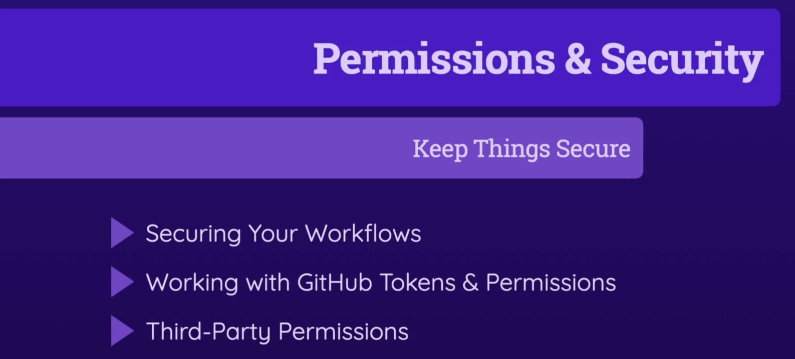
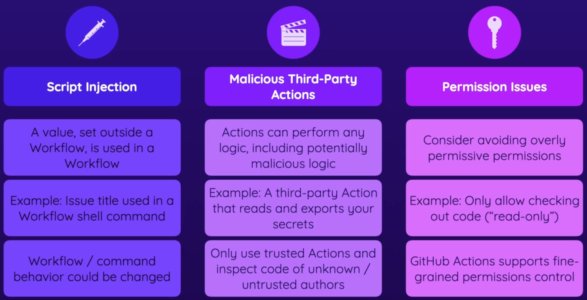

### 10 - Security & Permissions

- Security Concerns
  - 
In addition to the concepts covered in this module, you should absolutely also explore the security guides by GitHub itself:

- General overview & important concepts [here](https://docs.github.com/en/actions/security-guides/security-hardening-for-github-actions).
- More on Secrets [here](https://docs.github.com/en/actions/security-guides/encrypted-secrets).
- Using GITHUB_TOKEN [here](https://docs.github.com/en/actions/security-guides/automatic-token-authentication).
- Advanced - Preventing Fork Pull Requests Attacks [here](https://securitylab.github.com/research/github-actions-preventing-pwn-requests/).
- Security Hardening with OpenID Connect [here](https://docs.github.com/en/actions/deployment/security-hardening-your-deployments/about-security-hardening-with-openid-connect).
- More-on-GitHub-Actions-OpenID-Connect [here](https://docs.github.com/en/actions/deployment/security-hardening-your-deployments/about-security-hardening-with-openid-connect).
- AWS-GitHub-Actions-OpenID-Connect [here](https://docs.github.com/en/actions/deployment/security-hardening-your-deployments/configuring-openid-connect-in-amazon-web-services).
