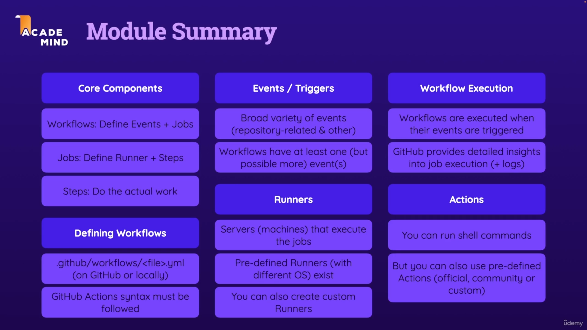

### 3 - GitHub Actions - Basic Building Blocks & Components



Notes:
- to run simple shell command `run: echo "Something"`
- for multiple shell commands
  - ```yaml
    run: |
      echo "First output"
      echo "Second output"
    ```
