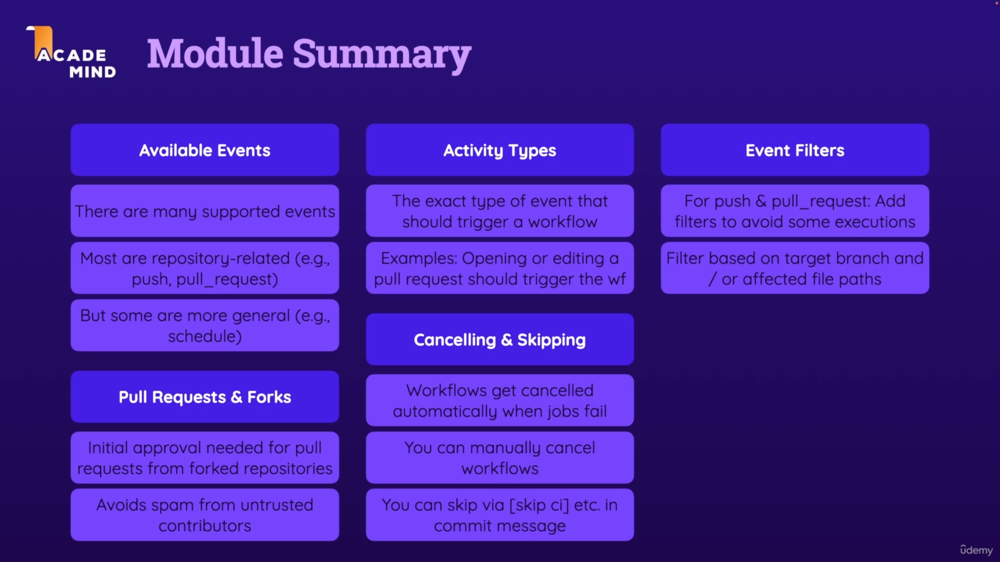

### 4 - Workflows & Events - Deep Dive

Notes:
- to skip workflow `git commit -m "commit msg [skip ci]"`
  - you can use:
    - or `[skip ci]` 
    - or `[ci skip]` 
    - or `[no ci]` 
    - or `[skip actions]` 
    - or `[actions skip]`
 