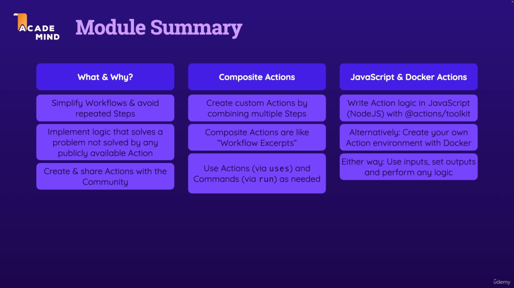
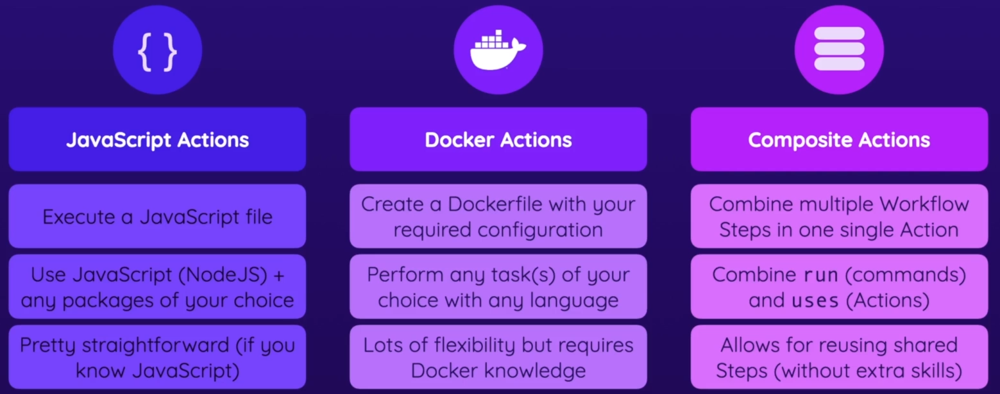

### 9 - Building & Using Custom Actions

Notes:
- Different Types of Custom Actions
  - 

- Composite Actions
  - to create a Composite Action
  - create a `actions` dir in `.github` dir(`.github/actions`)
    - e.g `.github/actions/cached-deps`
    - > Here these actions are for this project(Repo) only.
    - > To use thees actions for all projects(Repos) create a standalone Repo.
  - to use this actions:
    - if action is in the same Repo: `uses: ./.github/actions/cached-deps`
    - if action is in a standalone Repo: `uses: mmsaeed509/my-actions` (`github-username/repo-name`)

- JavaScript Actions 
  - to create a JavaScript Action
  - create a `actions` dir in `.github` dir(`.github/actions`)
    - e.g `.github/actions/deploy-s3-javascript` 
    - > Here these actions are for this project(Repo) only.
    - > To use thees actions for all projects(Repos) create a standalone Repo.
  - run `npm init -y` command in action dir(e.g `.github/actions/deploy-s3-javascript`) to install all dependencies
  - you need to install these dependencies `@action/core` `@action/github` `@action/exec`
    - `npm install @action/core @action/github @action/exec`
  - to use this actions:
    - if action is in the same Repo: `uses: ./.github/actions/deploy-s3-javascript`
    - if action is in a standalone Repo: `uses: mmsaeed509/my-actions` (`github-username/repo-name`)

- Docker Actions
  - to create a Docker Action
  - create a `actions` dir in `.github` dir(`.github/actions`)
    - e.g `.github/actions/deploy-s3-docker`
    - > Here these actions are for this project(Repo) only.
    - > To use thees actions for all projects(Repos) create a standalone Repo.
  - to use this actions:
    - if action is in the same Repo: `uses: ./.github/actions/docker`
    - if action is in a standalone Repo: `uses: mmsaeed509/my-actions` (`github-username/repo-name`)

---

### Standalone Actions

In this module, we created custom Actions that were stored in the same repository as our Workflow(s).

Alternatively, we could've stored the custom Actions in **separate repositories** (which therefore then only include the Action definition + code).

This is actually quite straightforward:

- Create a new, local project folder which contains your `action.yml` file + all the code belonging to the action (_Important_: **Don't** put your `action.yml` file or code in a `.github/actions` folder or anything like that - just keep it directly on the root level of your created project!).
- Add a local Git repository to your created project (via git init).
- Create your commit(s) `via git` add and `git commit`.
- Create a GitHub repository and connect it to your local Git repository (via `git remote add`).
- Add a tag via `git tag -a -m "My action release" v1`.
- Push your local code to the remote GitHub repository (via `git push --follow tags`).
- Use your custom Action in any other Workflow (in any other project and repository) by referencing the repository which contains your action (e.g., `my-account/my-action@v1`)

If your custom Action is stored in a public repository, it can also be published to the GitHub Actions Marketplace as described [here](https://docs.github.com/en/actions/creating-actions/publishing-actions-in-github-marketplace#publishing-an-action)