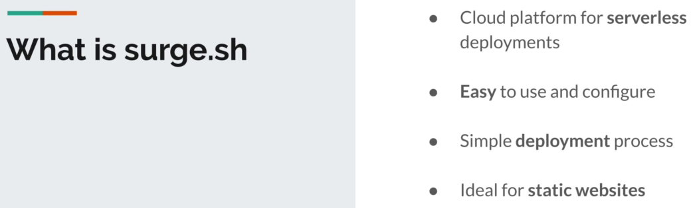

#### in this section:

- create a static website
- build and deploy using GitLab CI
- we will use an open source tool [Gatsby](https://www.gatsbyjs.com/)
  - to install Gatsby:
    - ```Bash
      npm install -g gatsby-cli
      # if you got some errors related to permissions use 
      sudo npm install -g gatsby-cli
      ```
___

#### Create Your 1st Project

- create a new project
  - ```Bash
    gatsby new static-website
    ```
- run local env
  - ```Bash
    cd static-website
    gatsby develop
    ```
- create a GitLab Repo [my-static-website](https://gitlab.com/mmsaeed509/my-static-website)
- add remote 
  - ```Bash
    git remote add origin git@gitlab.com:mmsaeed509/my-static-website.git
    ```
- push the new changes using [push.sh](./static-website/push.sh) script

---

#### build a website

- build the website

```Bash
gatsby build
```

- the artifact will be in the `public` directory

---

#### CI-CD

- in the [static-website](./static-website) directory, create `.gitlab-ci.yml`

```yaml
# the 1st Job Build the Website #
build website:
  # use node docker image #
  image: node
  script:
    - npm install
    - npm install -g gatsby-cli
    - gatsby build
  artifacts:
    paths:
      - ./public
```
---

#### Test

Why do jobs fail?

After a command is executed it will return an **exit status** code:

- `0` -> `Job succeeded`
- `1-255` -> `ERROR Job faild: exit code 1`

To show if the command is fail or success (this command run on: Linux, MAC-OS, GitLab CI)

```Bash
echo $?
```

so let's add the test Job

```yaml
# the 2nd Job Test the Artifacts #
test artifacts:
  
  script:
    - grep -q "Gatsby" ./public/index.html
```

---

#### optimize the Pipeline

- adding stages
- use `alpine` docker image in test as it's a small image
- add `test website` **Job**

```yaml
# define the stages #
stages:
  - build
  - test

# the 1st Job Build the Website #
build website:
  # Select the stage #
  stage: build
  # use node docker image #
  image: node
  script:
    - npm install
    - npm install -g gatsby-cli
    - gatsby build
  artifacts:
    paths:
      - ./public

# the 2nd Job Test the Artifacts #
test artifacts:
  # Select the stage #
  stage: test
  script:
    - grep -q "Gatsby" ./public/index.html

# the 2nd Job Test the Artifacts #
test website:
  # Select the stage #
  stage: test
  # use node docker image #
  image: node
  script:
    - npm install
    - npm install -g gatsby-cli
    - gatsby serve &
    - sleep 3
    - curl "http://localhost:9000" | tac | tac | grep -q "Gatsby" ./public/index.html
```

---

#### Deploy using `surge.sh`



[`Surge.sh`](https://surge.sh/) is a simple and powerful platform for deploying static websites effortlessly. It enables developers to quickly publish and share their HTML, CSS, and JavaScript projects with a global audience. Surge.sh simplifies the deployment process by providing a straightforward command-line interface, allowing users to deploy their projects with just a few commands. It's a popular choice for hosting static content, offering fast and reliable hosting with custom domain support.

using secrets (environment variable in GitLab)

- create a token `surge token`
- add secret, form the repo `Settings -> CI/CD -> Variables`

The final `.gitlab-ci.yml` file

```yaml
#####################################
#                                   #
#  @author      : 00xWolf           #
#    GitHub    : @mmsaeed509       #
#    Developer : Mahmoud Mohamed   #
#  﫥  Copyright : Exodia OS         #
#                                   #
#####################################

# use node docker image for all jobs #
image: node

# define the stages #
stages:
  - build
  - test
  - deploy

# the 1st Job Build the Website #
build website:
  # Select the stage #
  stage: build

  script:
    - npm install
    - npm install -g gatsby-cli
    - gatsby build
  artifacts:
    paths:
      - ./public

# the 2nd Job Test the Artifacts #
test artifacts:
  # Select the stage #
  stage: test
  script:
    - grep -q "Gatsby" ./public/index.html

# the 2nd Job Test the Artifacts #
test website:
  # Select the stage #
  stage: test

  script:
    - npm install
    - npm install -g gatsby-cli
    - gatsby serve &
    - sleep 3
    - curl "http://localhost:9000" | tac | tac | grep -q "Gatsby" ./public/index.html

# the 4th Job Deploy tp surge #
deploy tp surge:
  # Select the stage #
  stage: deploy
  script:
    - npm install -g surge
    - surge --project ./public --domain 00xwolf.surge.sh
```
