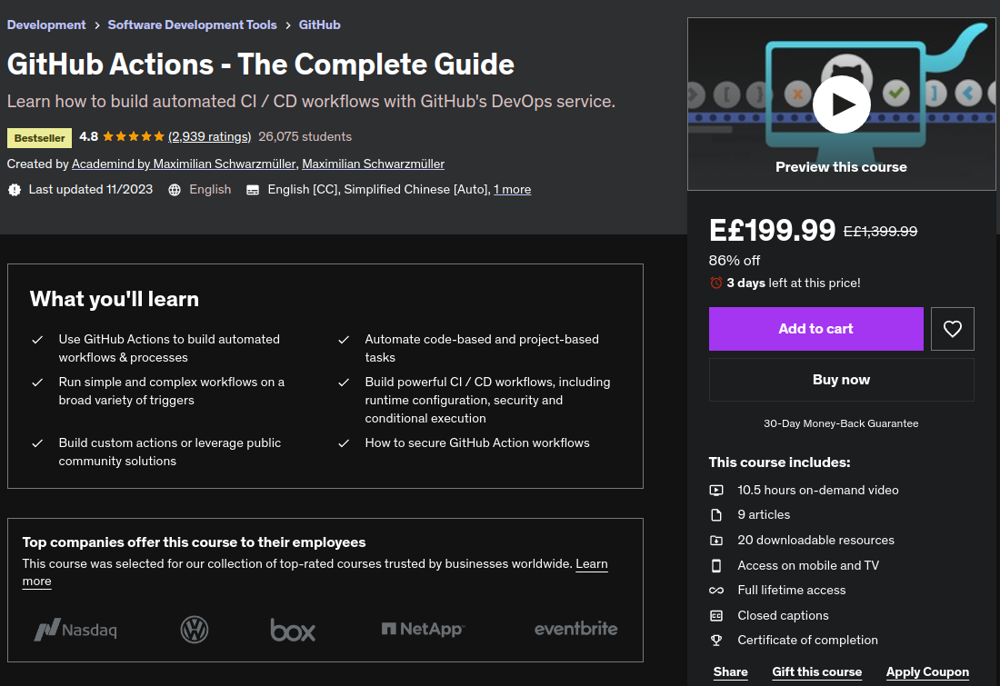
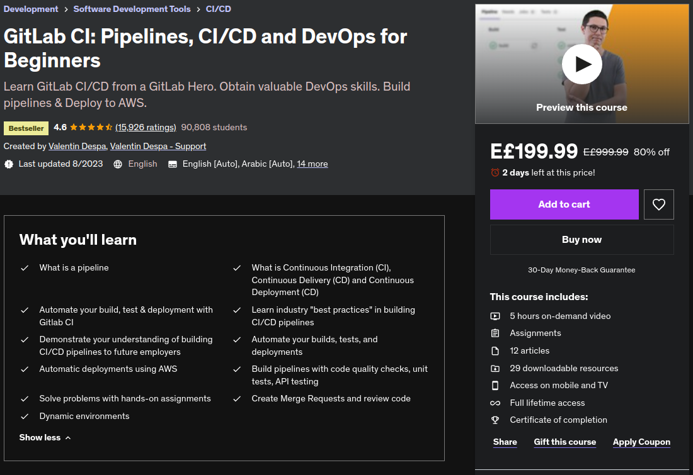
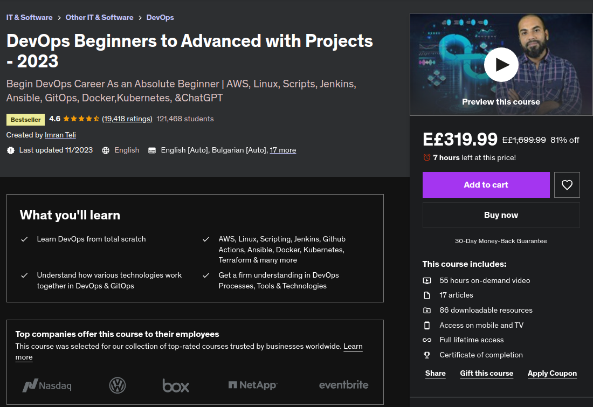

# CI/CD Courses

| [GitHub Actions - The Complete Guide](https://www.udemy.com/course/github-actions-the-complete-guide/) | [GitLab CI: Pipelines, CI/CD and DevOps for Beginners](https://www.udemy.com/course/gitlab-ci-pipelines-ci-cd-and-devops-for-beginners/) | [Jenkins: DevOps Beginners to Advanced](https://www.udemy.com/course/decodingdevops/) |
|--------------------------------------------------------------------------------------------------------|------------------------------------------------------------------------------------------------------------------------------------------|---------------------------------------------------------------------------------------|
|                      |                      |                                                         |

- [GitHub Actions - The Complete Guide](https://www.udemy.com/course/github-actions-the-complete-guide/)

  - Learn the ins and outs of GitHub Actions with this comprehensive guide. From setting up workflows to automating your CI/CD pipelines, this course covers everything you need to know to harness the power of GitHub Actions for efficient software development.

- [GitLab CI: Pipelines, CI/CD and DevOps for Beginners](https://www.udemy.com/course/gitlab-ci-pipelines-ci-cd-and-devops-for-beginners/)

  - Discover the fundamentals of GitLab CI and gain hands-on experience in setting up pipelines, implementing CI/CD practices, and embracing DevOps principles. This course is tailored for beginners looking to enhance their skills in the world of GitLab CI.

- [Jenkins: DevOps Beginners to Advanced](https://www.udemy.com/course/decodingdevops/)

  - Take a deep dive into Jenkins with this course designed for DevOps enthusiasts. From the basics to advanced topics, you'll learn how to leverage Jenkins for continuous integration and continuous delivery. Build a solid foundation in Jenkins and elevate your DevOps skills.
